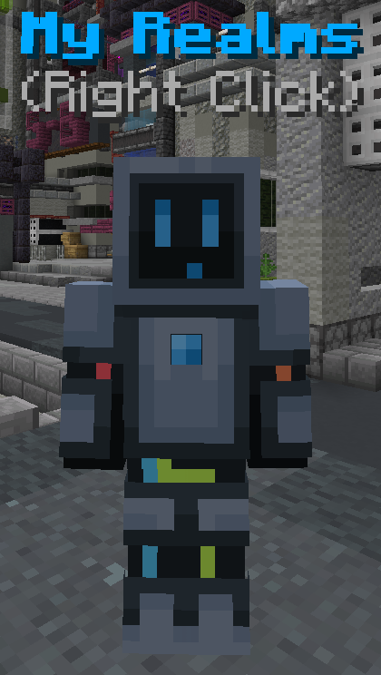
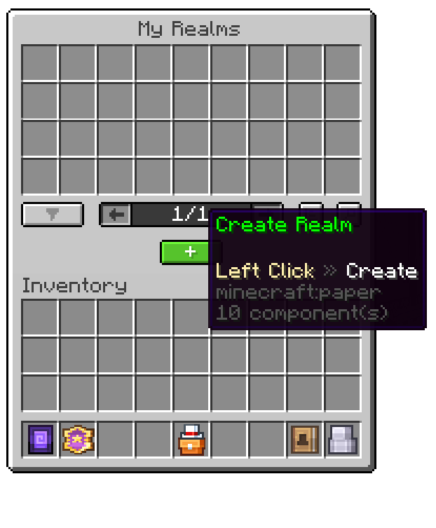
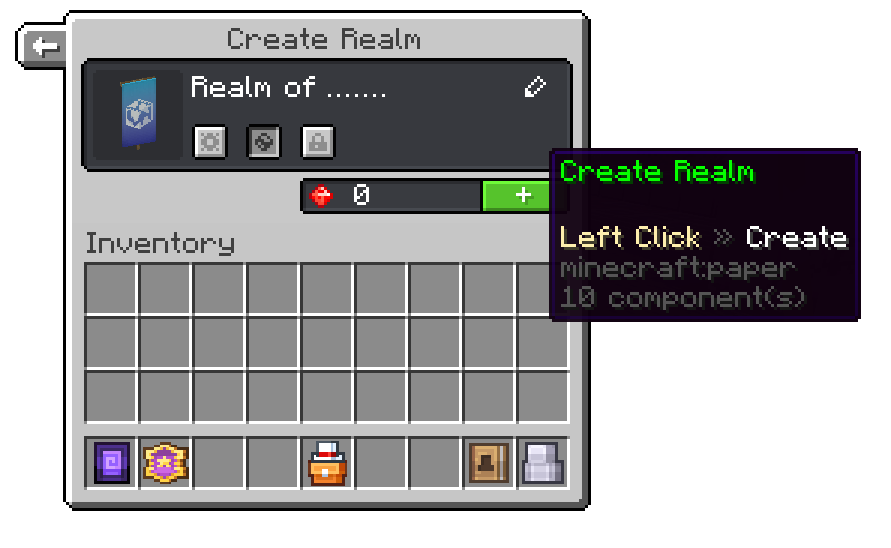

# Creating your first realm

##### This guide will explain to you how to create your first realm

To create your first realm, first you need to go to the [Realms lobby](./realm-lobby). There, you'll see an NPC on the right with the title `My Realms`.

Right-click it and then press the green button at the bottom, which is labeled `Create Realm`.

This will open a new GUI that prompts you to enter a name, select whether the realm should be private or not. You're also able to select a server template that'll download pre-defined plugins onto your server. Additionally, you can select an icon for your realm by clicking onto the banner on the left side.

Now you've created your realm. To configure it to fit your needs, you can [change its settings in the settings menu](./settings).
