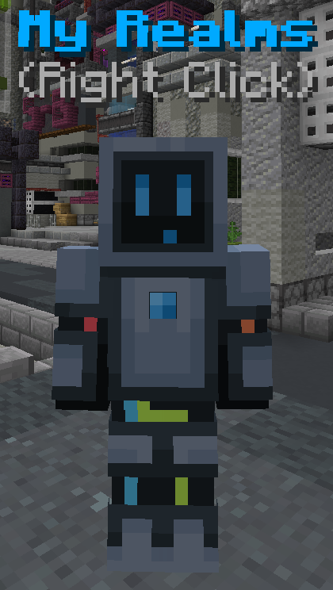

# Realm Lobby

You can access the realm lobby by clicking the realm icon in the navigator. If you right-click the icon, the browser opens directly to the realm.

## Realm Browser

Clicking the rotating world in the realm lobby opens the realm browser. This menu includes two lists of realms. Right-clicking a realm automatically joins it, while left-clicking opens an [external menu](#realm-menu).

The top list shows your recently visited realms, which you joined through the browser. The bottom list contains all public realms, which you can sort by popularity (based on player count and boosts), count of players, boosts, or alphabetically. Using the search function allows you to find realms, whether public or not. The five most popular realms (based on a popularity score) are highlighted on the podium.

## My Realms

You can access the "My Realms" menu by interacting with the NPC or right-clicking outside the browser.

This menu displays all realms you own or have favorited. You can filter this list to show only your realms or only your favored realms. If someone adds you to their whitelist, that realm will automatically be favorited for you.

## Realm Menu

Left-clicking a realm opens an external menu where you can join the realm or boost it. If you have the necessary access, you can also manage the realm. This includes changing [settings](./settings), accessing the [web interface](../web-interface), or performing actions such as starting, stopping, restarting, or unloading the realm.
If you have `Premium+`, you can boost any realm for free every month.

## Boosts

A player can boost a realm using 200 rubies or with a `Premium+` subscription. Boosting allows you to support your favorite realms.

The boost level determines the realm's limitations and features:

| Level | Features      | Max Players | Max Worlds | Max Groups | Max Plugins | Backups | Unload After Inactivity | RAM (GB) | Disk (GB) |
|-------|---------------|-------------|------------|------------|-------------|---------|-------------------------|----------|-----------|
| 0     |               | 5           | 1          | 1          | 3           | 1       | Very fast               | 2        | 2         |
| 1     | Own plugins   | 10          | 2          | 2          | 5           | 2       | 1 hour                  | 3        | 4         |
| 3     | Colored names | 15          | 3          | 3          | 10          | 3       | 2 hours                 | 4        | 6         |
| 5     |               | 20          | 4          | 5          | 12          | 5       | 3 hours                 | 5        | 8         |
| 10    | Subdomain     | 30          | 5          | 10         | 15          | 8       | 4 hours                 | 6        | 15        |
| 15    |               | 40          | 6          | 15         | 20          | 10      | 7 hours                 | 8        | 20        |
| 20    |               | 50          | 7          | 20         | 25          | 12      | 12 hours                | 10       | 30        |
| 25    |               | 100         | 11         | 100        | 100         | 15      | Never                   | 14       | 50        |