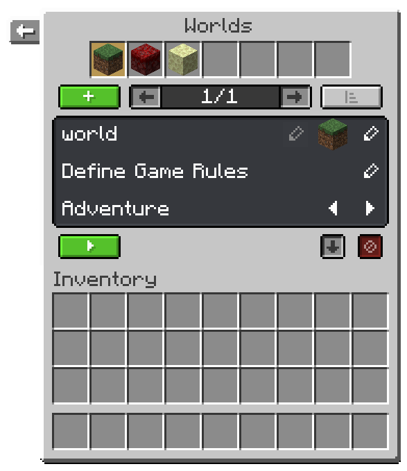
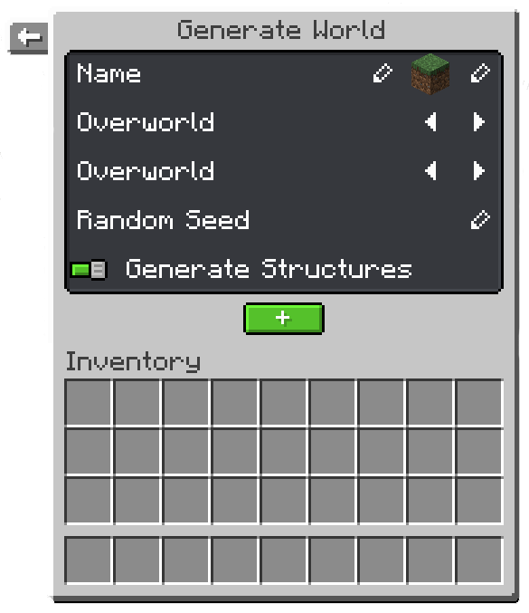

# World Management

##### This guide will explain how to manage multiple worlds on your realm.

### Overview

To open the world management interface, execute the command `/realm` in-game while you're on your realm.
Now click the world icon. This will open the world management interface for you.

At the top you can see all the worlds your realm has. By clicking on an icon, you access the settings for that world.

Below that you can create a new world by clicking the green button with the plus icon.

### World settings

At the top of the world settings, you can change the name of the world.
If the world is a default world
(which means that it has the name "world", "world_nether" or "world_the_end") its name can't be changed.
Next to that, you can also change the icon which will be used to display it in the world overview at the top.

Below that you can change the game rules, specific for each world. Examples for game rules include *PvP, Destruction by Creatures, Update Weather, Regenerate Hunger, Destruction by TNT* and *Player Damage*. You can edit that by clicking the edit icon on the right.

Below that you can also define whether a player should be automatically put into a game mode by changing it using the arrow icons on the right.

At the bottom you have three buttons. The green button with the arrow allows you to teleport to the world. The button that has an arrow pointing downwards is used to unload a world from the server's memory. The red button at the right deletes it. For the world to be deleted, it must be unloaded first.

### Create a new world

By clicking the green button with a plus icon, you can create a new world. A new ui will open for you. You're able to set a name and an icon for the newly created world.

Below that you can change the world's dimension type by clicking the arrows on the right. Available dimension types are: *Overworld, Nether, The End, Flat, The Void, Amplified, Large Biomes, and Custom*.

Next, you can define the environment of the world. Options include: *Overworld, Nether, The End, and Custom*.

You can also set a specific seed for the world by clicking the edit icon on the right and typing the seed you want into the chat.

At the bottom you can define whether structures are able to generate in the world.

Finally, press the green button with the plus symbol to create the world.

