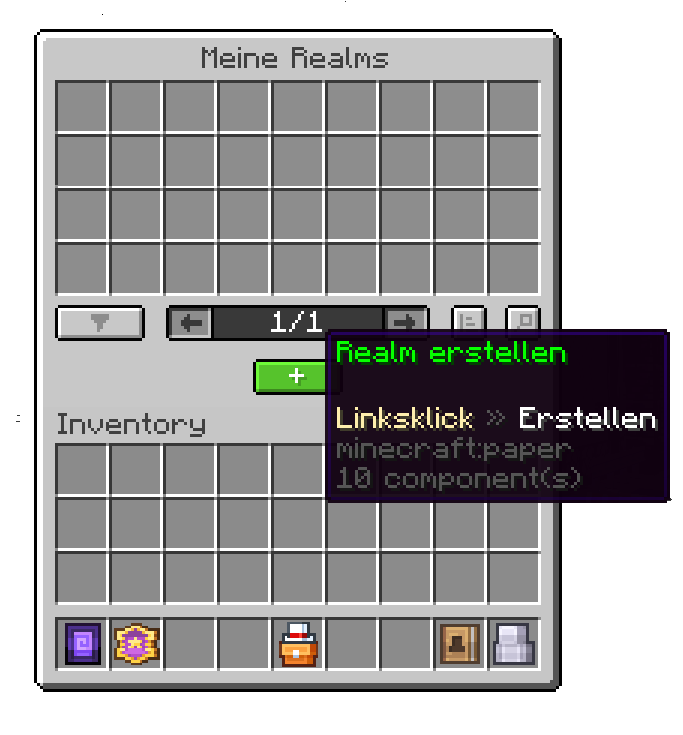
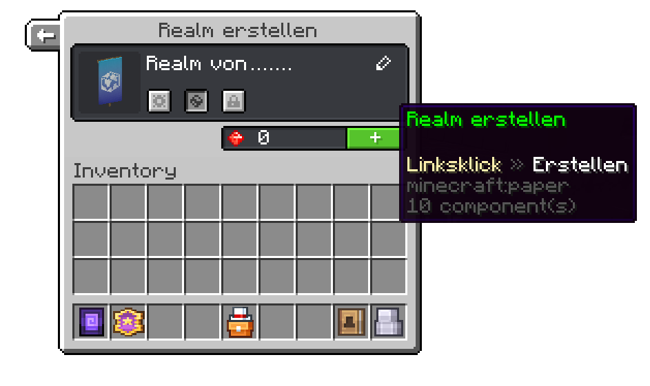

# Erstelle deinen ersten Realm

##### Dieser Guide wird dir erklären, wie du deinen ersten Realm erstellst.

Um einen Realm zu erstellen musst du dich erstmal in die Realms-Lobby begeben. Dort wirst du an der rechten Seite einen NPC mit dem Titel "Meine Realms" sehen.

Rechtsklicke den NPC und klicke dann auf den Knopf, der den Titel "Realm erstellen" hat.

Dies wird dich dazu auffordern, einen Namen für den Realm einzugeben und entscheiden, ob der Realm für alle Spieler zugänglich sein soll oder nicht. Du kannst ebenfalls eine Vorlage für deinen Realm auswählen, womit bestimmte Plugins automatisch auf deinen Realm installiert werden. Du kannst ebenfalls das Icon für den Realm auswählen, indem du auf das Banner klickst.

Nun hast du deinen Realm erstellt. Um ihn nach deinen Vorstellungen anzupassen, kannst du [die Einstellungen im Einstellungsmenü ändern](./settings).
