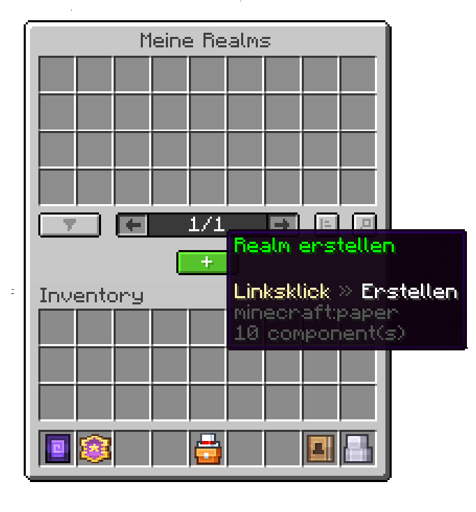
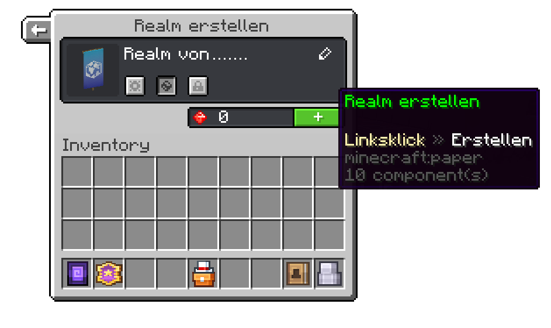

# Erstellung deines ersten Realms

##### Diese Seite erklärt dir, wie du deinen ersten Realm erstellen kannst

Um deinen ersten Realm zu erstellen, musst du zuerst in die [Realm-Lobby](./realm-lobby) gehen. Dort wirst du einen NPC sehen mit dem Titel `Meine Realms`.

Rechtsklicke diesen und betätige den grünen Knopf `Realm erstellen`.

Diese Aktion öffnet eine weitere Oberfläche, um den Realm-Namen einzustellen. Du kannst außerdem einstellen, ob dein Realm privat oder öffentlich zugänglich sein soll. Es gibt ebenfalls die Möglichkeit, direkt eine Vorlage mit vordefinierten Plug-Ins zu laden. Zusätzlich kannst du mit einem Klick auf das Realm-Banner dieses verändern.

So einfach hast du deinen Realm erstellt. Um diesen weiter zu konfigurieren, kannst du zusätzliches in [den Einstellungen](./settings) ändern.