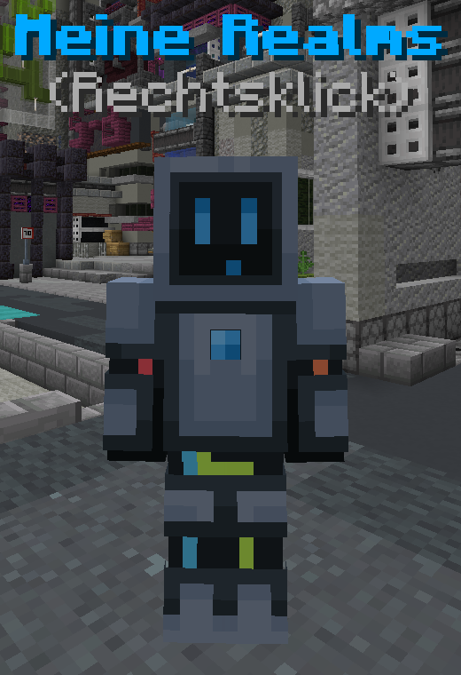

# Realm Lobby

Die Realm-Lobby ist mit dem Realm-Symbol im Navigator erreichbar. Mit einem Rechtsklick öffnet sich direkt der Browser.

## Realm Browser

Mit dem Klicken auf die drehende Erde öffnet sich der Realm Browser. Dieses Menu beinhaltet zwei Listen. Mit einem Rechtsklick auf einen Realm trittst du diesem direkt bei. Mit einem Linksklick wird ein [externes Menu](#realm-menu) geöffnet.

Die obere Liste zeigt kürzlich besuchte Realms, die direkt betreten werden können. In der unteren Liste sind alle öffentlichen Realms. Diese können anhand der Beliebtheit (abhängig von Spieleranzahl und Boost Level), der Spieleranzahl, der Boostanzahl oder alphabetisch sortiert werden. Außerdem enthält das Menu eine Suchfunktion, mit der Realms, egal ob öffentlich oder nicht, gefunden werden können. Die fünf beliebtesten Realms (abhängig des Beliebtheit-Wertes) werden auf dem Podest hervorgehoben.

## Meine Realms

Du kannst auf das "Meine Realms" Menu zugreifen, in dem du mít dem NPC interagierst oder einen Rechtsklick außerhalb des Browsers durchführst.

Dieses Menu zeigt alle Realms, die dir gehören oder die du favorisiert hast. Du kannst die Realms nach verschiedenen Kriterien filtern. Es können nur Realms angezeigt werden, die dir gehören oder nur die, welche du favorisiert hast. Sollte jemand dich auf seine Gästeliste hinzufügen, wird der Realm automatisch favorisiert.

## Realm Menu

Mit einem Linksklick auf einen Realm öffnet sich ein externes Menu, in dem man dem Realm beitreten kann und ihn direkt boosten kann. Sollte man die benötigten Berechtigungen haben, ist es möglich den Realm zu verwalten. Du kannst direkt [Einstellungen](./settings) vornehmen oder das [Web-Interface](../web-interface) öffnen. Es gibt außerdem die Möglichkeit, den Realm zu starten, zu stoppen, neuzustarten oder zu entladen.
Solltest du `Premium+` haben, kannst du einen beliebigen Realm kostenlos monatlich boosten.

## Boosts

Ein Spieler kann einen Boost für einen Realm mit 200 Rubinen kaufen oder hat mit `Premium+` einen kostenlosen Boost monatlich. Mit einem Boost kannst du deinen Lieblingsrealm unterstützen.

Das Boost-Level legt Limitationen für den Realm fest.

| Level | Besonderheit    | Max. Spieler | Max. Welten | Max. Gruppen | Max. Plug-Ins | Wiederherstellungs-punkte | Entladung Nach Inaktivität | RAM (GB) | Speicherplatz (GB) |
|-------|-----------------|--------------|-------------|--------------|---------------|---------------------------|----------------------------|----------|--------------------|
| 0     |                 | 5            | 1           | 1            | 3             | 1                         | Sehr schnell               | 2        | 2                  |
| 1     | Eigene Plug-Ins | 10           | 2           | 2            | 5             | 2                         | eine Stunde                | 3        | 4                  |
| 3     | Farbige Namen   | 15           | 3           | 3            | 10            | 3                         | 2 Stunden                  | 4        | 6                  |
| 5     |                 | 20           | 4           | 5            | 12            | 5                         | 3 Stunden                  | 5        | 8                  |
| 10    | Subdomain       | 30           | 5           | 10           | 15            | 8                         | 4 Stunden                  | 6        | 15                 |
| 15    |                 | 40           | 6           | 15           | 20            | 10                        | 7 Stunden                  | 8        | 20                 |
| 20    |                 | 50           | 7           | 20           | 25            | 12                        | 12 Stunden                 | 10       | 30                 |
| 25    |                 | 100          | 11          | 100          | 100           | 15                        | Nie                        | 14       | 50                 |