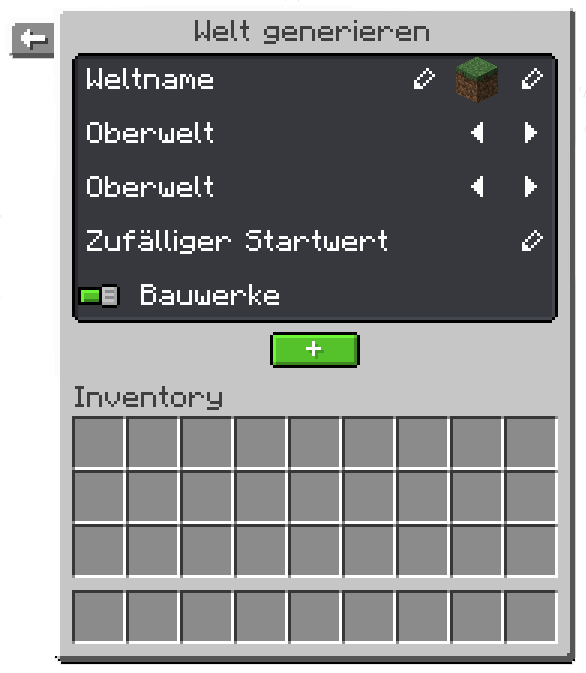

# Weltenverwaltung

##### Diese Seite erklärt, wie man auf seinem Realm Welten verwalten kann.

### Übersicht

Um auf die Weltenverwaltung zugreifen zu können, musst du erstmal den Befehl `/realm` in-game ausführen, während du dich auf dem Realm befindest.
Klicke nun auf das Welt-Symbol. Dies wird die Weltenverwaltung öffnen.

Oben kannst du alle Welten sehen, die sich auf deinem Realm befinden. Durch das Klicken auf ein Icon öffnen sich die Einstellungen für die jeweilige Welt.

Darunter kannst du durch das Klicken auf den Knopf mit dem Plus-Symbol eine neue Welt erstellen.

### Welteneinstellungen

Oben kannst du den Namen für die Welt ändern.
Falls die Welt eine vordefinierte Welt ist
(was du daran erkennst, dass die Welt "world", "world_nether" oder "world_the_end" heißt), kann der Name dieser Welt nicht geändert werden.
Daneben kannst du auch das Icon für die Welt ändern, welches du dann oben in der Weltenübersicht sehen kannst.

Darunter kannst du die Spielregeln für die jeweilige Welt ändern. Beispiele für Spielregeln sind: *PvP, Zerstörung durch Kreaturen, Wetterwechsel, Hunger regenerieren, Zerstörung durch TNT* und *Spielerschaden*. Diese und weitere Einstellungen kannst du durch das Klicken auf das Bearbeiten-Symbol ändern.

Darunter kannst du durch das Klicken auf die Pfeile den Spielmodus setzen, den ein Spieler beim Beitritt der Welt zugewiesen bekommt.

Ganz unten befinden sich drei Knöpfe. Der grüne Knopf erlaubt dir, dich in die Welt zu teleportieren. Der Knopf mit einem nach unten zeigenden Pfeil entlädt die Welt vom Arbeitsspeicher des Servers. Der rote Knopf ganz rechts löscht die Welt. Damit eine Welt gelöscht werden kann muss sie erstmal entladen werden. Vorgegebene Welten können weder entladen, noch gelöscht werden.

### Eine neue Welt erstellen

Du kannst eine neue Welt erstellen, indem du auf den grünen Knopf mit dem Plus-Symbol drückst. Ein neues Fenster wird sich für dich öffnen. Du kannst einen Namen und ein Icon für die neu erstellte Welt setzen.

Darunter kannst du den Dimensionstypen für die Welt festlegen, indem du die Pfeile am Rand nutzt. Vorgegebene Dimensionstypen sind: *Oberwelt, Nether, Das Ende, Flachland, Die Leere, Zerklüftet, Große Biome, und Benutzerdefiniert*.

Als Nächstes kannst du die Umgebung für die Welt festlegen. Die vorgegebenen Optionen beinhalten: *Oberwelt, Nether, Das Ende, und Benutzerdefiniert*. 

Du kannst auch einen Startwert (besser bekannt als "Seed") für die Welt festlegen, indem du auf das Bearbeiten-Symbol klickst und den gewünschten Startwert in den Chat eingibst.

Ganz unten kannst du festlegen, ob Bauwerke in der Welt spawnen dürfen.

Letztendlich drücke auf den grünen Knopf, um die Welt zu generieren.

